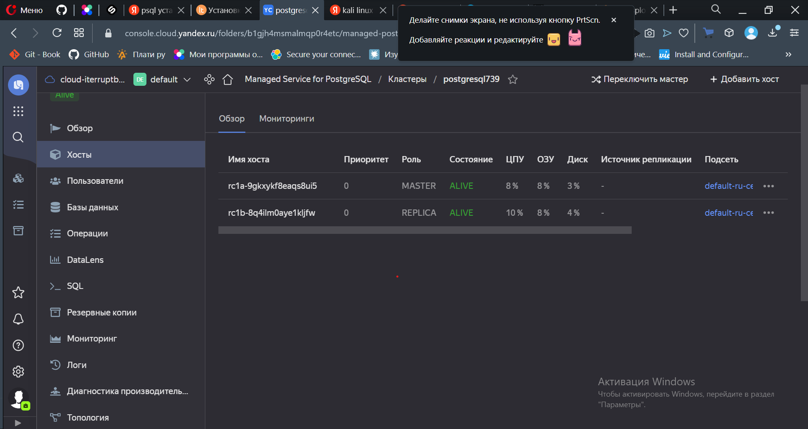
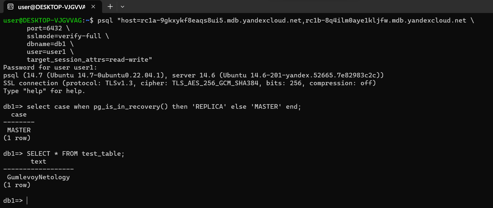
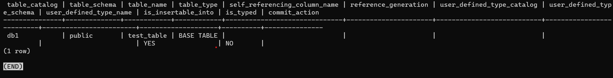
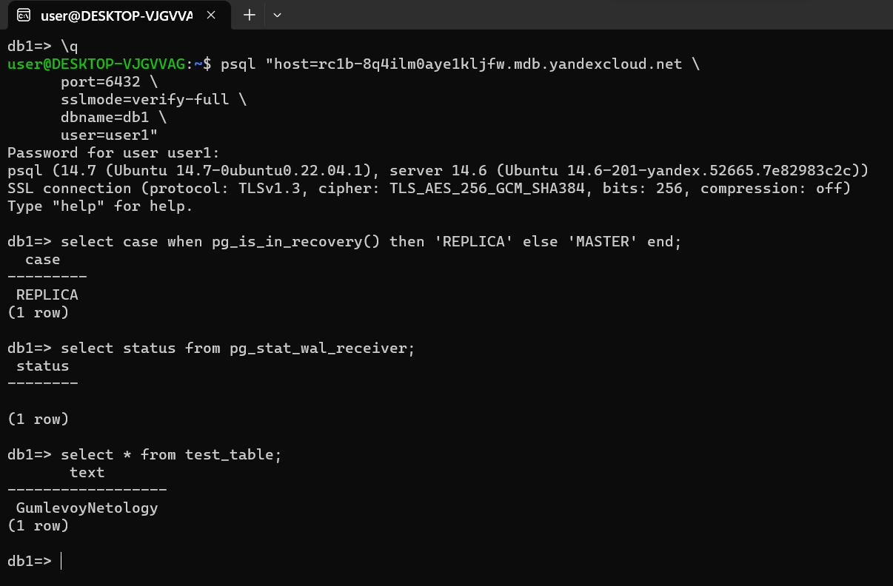

# Домашнее задание к занятию 12.09. «Базы данных в облаке» - Александр Гумлевой

### Задание 1


#### Создание кластера  
Скрин кластера  
  
1) Созданная база данных;  
  
  
2) Результата вывода команды на реплике ```select * from test_table;```.
  
